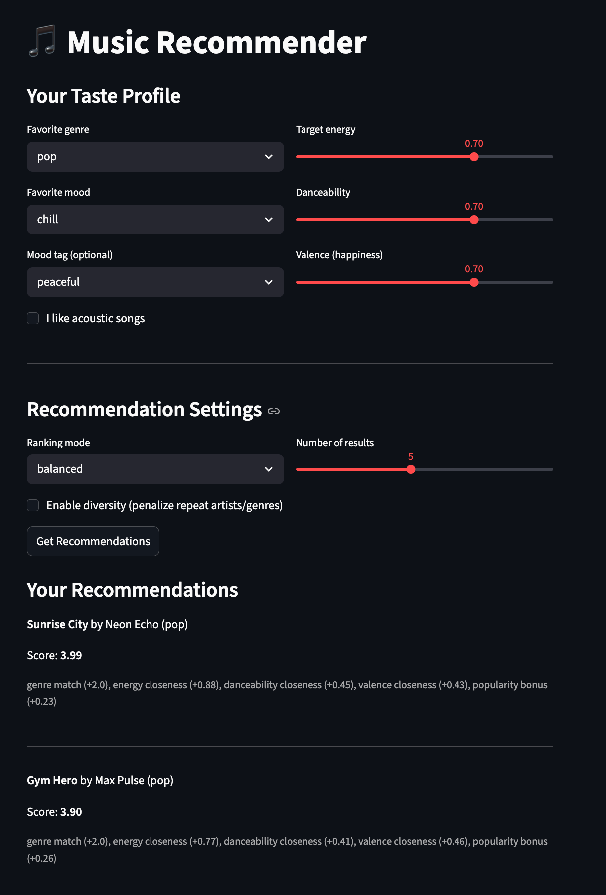
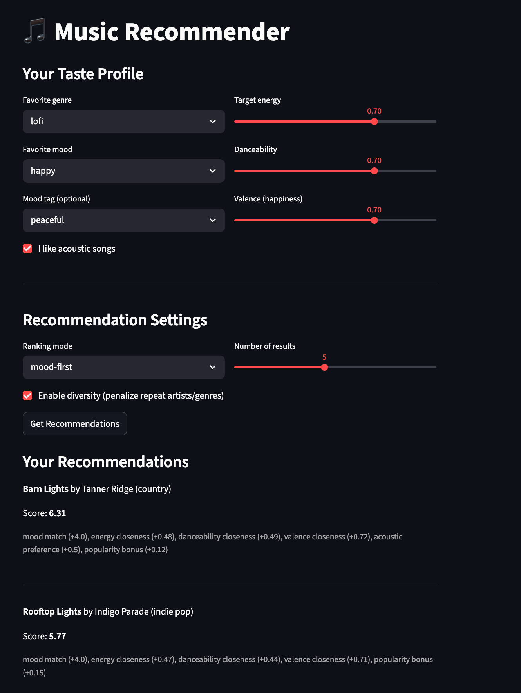
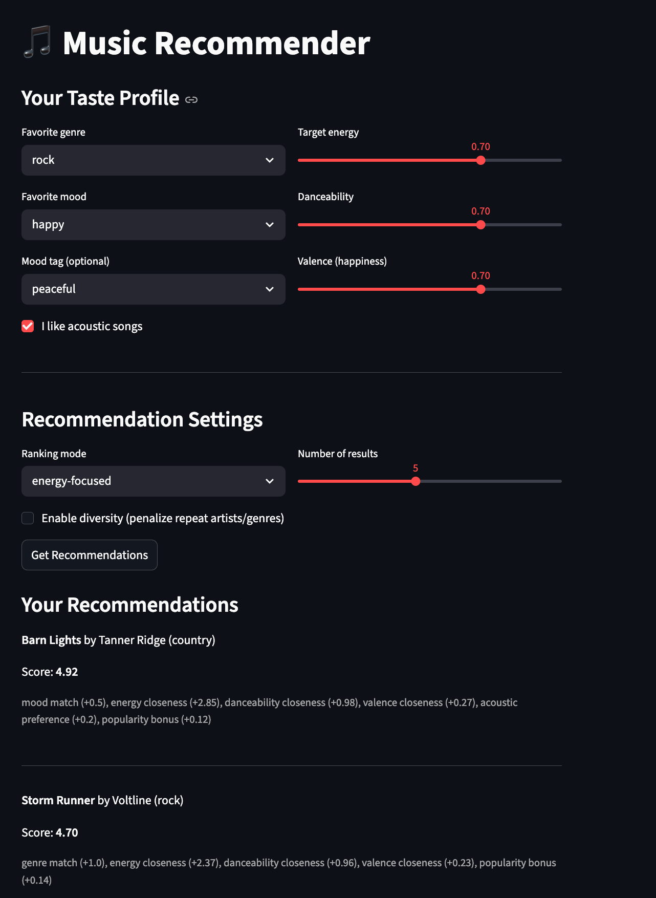

# Music Recommender Simulation

A simple music recommendation system built with Python. It takes a user's taste profile (favorite genre, mood, energy level, etc.) and scores songs from a catalog to suggest the best matches.

## How The System Works

Real music apps like Spotify and YouTube use a mix of two approaches to recommend songs. The first is collaborative filtering, which looks at what other users with similar taste are listening to. The second is content-based filtering, which looks at the actual features of songs you already like (genre, tempo, energy, mood) and finds more songs with similar features.

My system uses content-based filtering since we don't have real user data. Here's how it works:

- Each **Song** has attributes like genre, mood, energy, danceability, valence, acousticness, popularity, and more
- A **UserProfile** stores what the user prefers: favorite genre, favorite mood, target energy, whether they like acoustic music, etc.
- The **scoring function** goes through every song in the catalog and gives it a score based on how well it matches the user's preferences
- Songs get ranked by score, and the top results are returned as recommendations

The scoring works like a point system:
- Genre match: +2.0 points
- Mood match: +1.5 points
- Energy closeness: up to +1.0 (the closer the song's energy is to what the user wants, the more points)
- Danceability and valence closeness: up to +0.5 each
- Acoustic preference: +0.5 if the user likes acoustic and the song is acoustic
- Popularity bonus: up to +0.3
- Mood tag match: +0.5

The system also supports different ranking modes (genre-first, mood-first, energy-focused) and a diversity penalty that prevents too many songs from the same artist or genre showing up in the results.

## Setup

```bash
python -m venv .venv
source .venv/bin/activate
pip install -r requirements.txt
```

## Running the Demo

```bash
python -m src.main
```

## Running the Streamlit App

```bash
streamlit run app.py
```

## Running Tests

```bash
pytest
```

10 tests covering: scoring logic, sorting, loading, genre matching, different profiles, diversity, and the Recommender class.

## Experiments I Tried

### Different User Profiles

I tested three different profiles to see how the system handles different tastes:

**High-Energy Pop Fan** (genre=pop, mood=happy, energy=0.85)
- Top results were Sunrise City and Gym Hero, both pop songs. Makes sense.

**Chill Lofi Listener** (genre=lofi, mood=chill, energy=0.35, likes_acoustic=True)
- Top results shifted to Library Rain and Midnight Coding. The acoustic bonus helped lofi tracks with high acousticness score higher.

**Intense Rock Lover** (genre=rock, mood=intense, energy=0.92)
- Storm Runner came out on top. Iron Tide (metal) also ranked high because of the mood and energy match even though genre was different.

The biggest takeaway: genre and mood matches dominate the scores. When those don't match, energy closeness becomes the tiebreaker.

### Ranking Modes

Switching between modes changed the results noticeably:
- **Genre-first** mode made genre worth 4.0 points instead of 2.0, so it strongly favored same-genre songs
- **Mood-first** mode boosted mood to 4.0, which surfaced songs from different genres that shared the same vibe
- **Energy-focused** mode made energy worth 3.0, so high-energy songs clustered together regardless of genre

### Diversity Penalty

Without diversity, a pop fan gets two pop songs in the top 3. With diversity on, the second pop song gets penalized and drops down, making room for songs from other genres. This felt more like what a real app would do.

## Demo Screenshots

### Profile 1: Pop/Happy


### Profile 2: Lofi/Chill


### Profile 3: Rock/Intense


## Limitations and Risks

- The catalog is only 20 songs, so the system can't really show its full potential
- It doesn't understand lyrics or language, so it might recommend a song in a language the user doesn't speak
- Genre matching is exact. "indie pop" and "pop" are treated as completely different, which isn't great
- It might over-favor popular songs because of the popularity bonus
- There's no way to learn from what the user actually listens to or skips

## Reflection

Building this made me realize how much work goes into even a simple recommender. The hardest part was figuring out the right weights. Too much weight on genre and everything feels repetitive. Too little and the recommendations feel random. Real apps like Spotify probably spend a lot of time tuning these numbers with actual user data.

I also noticed how easy it is for bias to sneak in. My dataset has more pop and lofi songs than classical or folk, so users who like those genres get fewer good matches. In a real product, this could mean some users get a worse experience just because their taste isn't well represented in the data. That's something I didn't think about before this project.

[**Model Card**](model_card.md)
